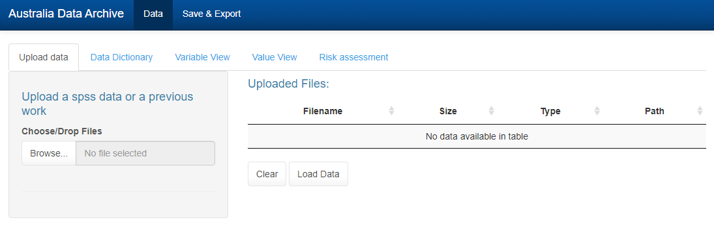
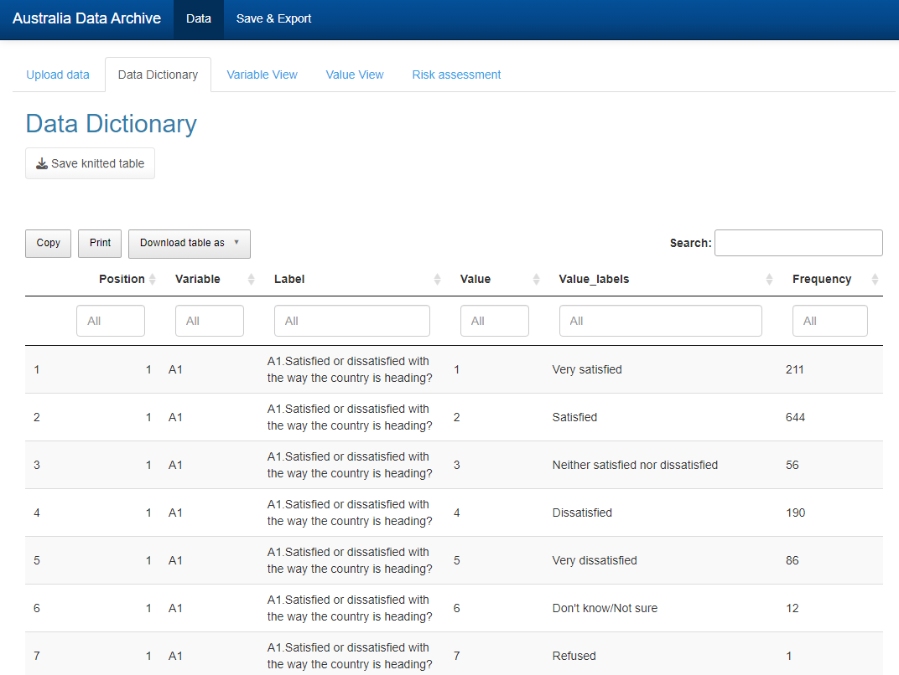
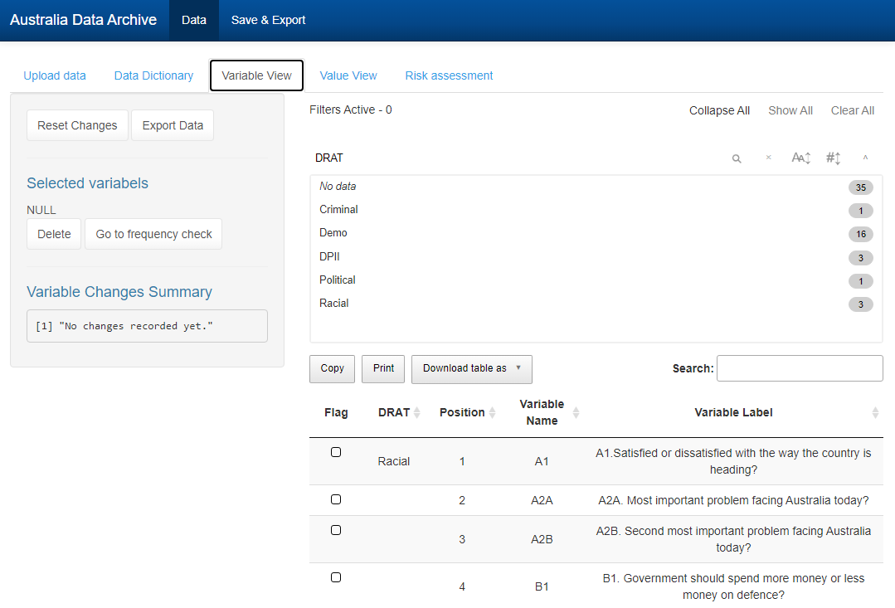
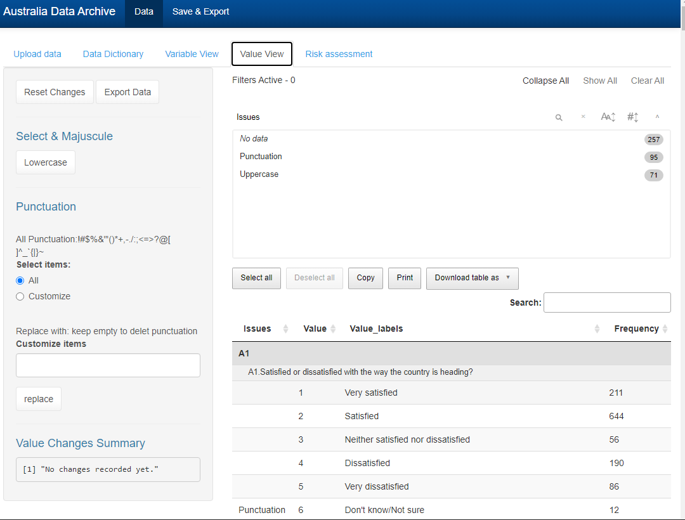
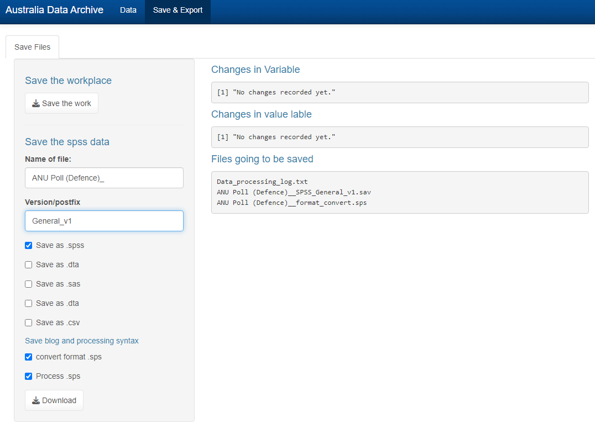

# ADA_DRAT_v2
 For 2023 eResearch
 
### Install all dependencies
For compatible reasons, we are going to use R 4.2.X and DT 0.2.5 


```R
install.packages(c('haven','labelled','tidyverse','dplyr','flextable','officer','stringr','sjlabelled','foreign','car','reshape2','gmodels','epiDisplay','shiny','remotes'))
```

particular in Rshiny, DT 0.25 version will be used to prevent incompatible with CellEdits.
    
```R

remove.packages("DT") 

remotes::install_version("DT", version = "0.25")     
```


## Demo
You can also using the link [ShinyApp.IO](https://67g7sg-weifanjiang0anu.shinyapps.io/ADA_DRATv2/), to give it a try. And make sure your data is secure, please do not upload sensitive data. The best way to make sure your data is depoly project on your local computer. If you wanna have a demo, you can use training version data from Data folder instead.

## Documentation


### Upload data



<!-- <p align="center">
    
  <h4 align="center">Upload data page</h4>
<p align="center">
    </p> -->
    
 DRAT tool allows users to upload data files for assessment. Multiple files can be uploaded at once and stored in preparation for risk assessment. 
Multiple files can be dragged and dropped onto the ‘Choose/Drop Files’ bar or selected from the local computer using the ‘Browse’ function. Uploaded files can be selected for assessment using the ‘Load Data’ option. 

### Dictionary view



<!-- {:height="100px" width="100px"} -->

Loaded data can then be viewed in the Data Dictionary screen. All variable and value information is displayed. 
Users can refine the table using the search boxes at the top of each column. Users can copy the displayed table to the clipboard or download the table as a CSV, Excel, or PDF Data Dictionary file.  


### Variable View 



#### Sensitive data keyword search.  
In the ‘Variable View’ screen, the DRAT will flag variables with categories of potentially sensitive data including questions about religion, racial identity, pollical affiliation, or criminal behaviour. 


Currently this function can highlight potential variables of concern. The DRAT may eventually use this information to classify datasets according to disclosure risk. 

 
Users can reclassify variables in the drop-down menus to reject the sensitive data flag, or manually flag a variable that the DRAT has failed to detect. 


### Value View




##### Removing punctuation from labels
Users can use top searchPanel to filter tables with punctuation. with ctrl/shift + click highlighting in bulk, punctuations chosen to remove can be removed from highlighted value labels. 

##### Removing inconsistent uppercase text. 
As above, the user can filter the table by top search panels with inconsistent uppercase. The consideration includes 
 * The initial value label is not capitalised 
 * Two or more uppercase in a single word, uppercase in the middle of a word.
therefore, the user must unselect rows that contain acronyms, such as USA, NSW, CSRM, 


### Save & export



#### Save breakpoint
Save as breakpoint function, will collect all parameters that DRAT have, and store it as R Data Serialization R Data Serialization (.rds) file. then you can upload the saved data file in the first place to recover the work process.

#### Save data and syntax

By ticking checkboxes, the user can save the edited data as .sav .sas7bdat .csv and .dta. the data name will be \[Dataset_name\]_\[data format\]_\[version_name\].\[format\]

DRAT will create SPSS syntax that reflects all the processing the user has done before, by ticking .sps syntax check box.

DRAT will also create SPSS syntax that converts .sav data to .sas7bdat .csv and .dta, by ticking .sps syntax check box. As R can not create .sas syntax file along with .sas7bdat.


## Example case

See [ANUPoll training data]()

Goto main page:[ShinyApp.IO](https://67g7sg-weifanjiang0anu.shinyapps.io/ADA_DRATv2/), or press `Run App` on top of RStudio.


